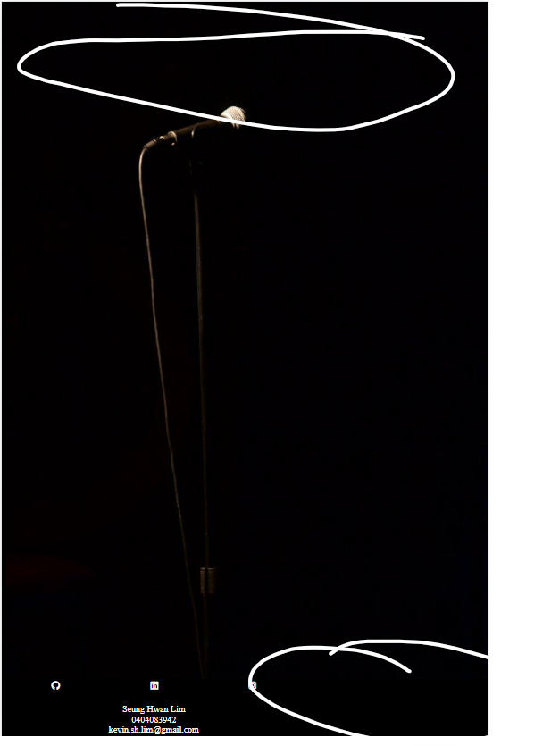

<!-- box sizing: border box in css to make sure it doesnt scroll horizontally -->

# 21/03/2023

## beginning of the project

homepage and the basic scss has been started. currently trying to figure out why my footer is not spanning the whole width of the screen as well as try to make nav button align and space equally along the right had side of the page.

i will need to edit the image so i dont have to scroll down to see the footer. 

basically the first iterations of the index.html and index.scss.

# 23/03/2023

## Re doing the initial desgn and making a mash up.

changed the whol color palette and the concept.

Photo by <a href="https://unsplash.com/@ton1_g?utm_source=unsplash&utm_medium=referral&utm_content=creditCopyText">Toni G</a> on <a href="https://unsplash.com/photos/4I9mhwxWF9I?utm_source=unsplash&utm_medium=referral&utm_content=creditCopyText">Unsplash</a>

https://www.hungrybearstudios.com/
  